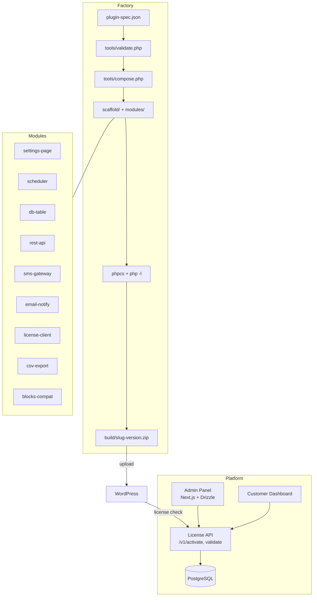

# AnsariAi WP — WordPress Plugin Factory + SaaS License Platform

**سازنده / Author:** Mohammad Ansari — [ansariai.ir](https://ansariai.ir)

[](https://github.com/ansariaiadmin/aiwp/actions/workflows/qa.yml)
[](https://github.com/ansariaiadmin/aiwp/actions)
[](https://www.php.net/)
[](https://wordpress.org/)
[](LICENSE)
[](platform/)

> Spec-driven factory that turns a 30-line JSON spec into a production-grade, installable WordPress plugin — plus a full SaaS platform for license management, with admin and customer dashboards sharing the same API contract.

## 🚀 برای افراد غیر فنی / For Non-Technical Users — نصب در ۱ دقیقه!

**فقط یک دستور / Just one command:**

```bash
git clone https://github.com/ansariaiadmin/aiwp.git
cd aiwp
chmod +x install.sh
./install.sh
```

سپس مرورگر را باز کنید و تمام! / Then open browser and done!

- **راهنمای کامل فارسی:** [`INSTALL.md`](INSTALL.md) یا [`docs/USER_GUIDE_FA.md`](docs/USER_GUIDE_FA.md)
- **Full English Guide:** [`docs/USER_GUIDE_EN.md`](docs/USER_GUIDE_EN.md)
- **آپدیت:** `./update.sh` (بکاپ خودکار + آپدیت + سلامت چک)
- **وضعیت:** `./status.sh` | **لاگ:** `./logs.sh` | **توقف:** `./stop.sh`

**ویژگی‌های نسخه v1.0.1 / v0.9.1:**
- ✅ نصب خودکار تمیز (clean install) — چک Docker، ساخت .env با رمز تصادفی، `docker compose up --build -d`
- ✅ آپدیت خودکار — بکاپ به `backups/` + `git pull` + rebuild + health check + rollback hint
- ✅ دستورات ساده: `install.sh`, `update.sh`, `start.sh`, `stop.sh`, `status.sh`, `logs.sh`, `backup.sh`
- ✅ ویندوز: `install.bat`, `update.bat`, etc.
- ✅ آموزش کامل تمام بخش‌ها در `docs/USER_GUIDE_FA.md` (فارسی)

> **برای افراد کاملا غیر فنی:** فقط `install.sh` را اجرا کنید، بعد آدرس را در مرورگر باز کنید — همین! (see `INSTALL.md`)

---


---

## What this proves (for freelance clients)

- **Spec-driven code generation at scale:** One JSON file → complete plugin with settings, REST API, DB tables, background jobs, SMS/email, license client, WooCommerce HPOS safety. No scaffold edits needed for new plugins. Demonstrates architecture for rapid product factories.
- **WordPress security & standards mastery:** Every generated file enforces `ABSPATH` guard, nonce + `current_user_can()` on writes, `sanitize_*`/`esc_*`, `$wpdb->prepare()`, WPCS 3.x + PHPCompatibilityWP zero errors, `wc_get_orders()` CRUD (never direct postmeta), Action Scheduler with wp-cron fallback.
- **Full-stack SaaS platform:** `platform/` is a production Next.js 16 + TypeScript + Drizzle/PostgreSQL app with separate admin (products, licenses, users, AI provider settings — any model/provider, SMS gateway, audit log) and customer dashboards, Docker + Nginx + Let's Encrypt deployment guide.

---

## Architecture



**Code sample — adding a module in spec (no PHP edits):**

```json
{
  "slug": "my-crm",
  "version": "1.0.0",
  "modules": ["settings-page", "db-table", "rest-api", "license-client", "sms-gateway"],
  "settings": {
    "kavenegar_api_key": {"type": "string", "required": true}
  },
  "db_tables": {
    "contacts": {"columns": {"id": "BIGINT AUTO_INCREMENT", "phone": "VARCHAR(20)"}}
  }
}
```

---

## Sample Output

```bash
$ php tools/tests/run-tests.php
25 passed, 0 failed

$ composer validate --strict
./composer.json is valid

$ php -l modules/blocks-compat/module.php
No syntax errors detected
```

## Quickstart (tested)

```bash
# 1. Clone & install tooling (PHPCS + WPCS + PHPCompatibility)
git clone https://github.com/ansariaiadmin/aiwp.git
cd aiwp
composer install

# 2. Validate composer.json and lint (real CI commands)
composer validate --strict
composer lint

# 3. Write a spec from example
cp spec/examples/store-health.json spec/my-plugin.json
# edit spec/my-plugin.json

# 4. Fast pre-check
php tools/validate.php spec/my-plugin.json

# 5. Build: validate -> compose -> syntax check -> lint -> zip
php tools/build.php spec/my-plugin.json
# -> build/my-crm-1.0.0.zip ready for wp-admin upload

# 6. (Optional) QA in disposable WP+MariaDB sandbox
sandbox/scripts/qa.sh build/my-crm-1.0.0.zip

# Platform (SaaS) quickstart
cd platform
cp .env.example .env
npm ci
npm run dev
# Admin: http://localhost:3000/admin
# Customer: http://localhost:3000/dashboard
```

---

## Features Table

| Feature | Factory Enforces | Platform Provides |
|---------|------------------|-------------------|
| **Security** | ABSPATH guard, nonce, capability checks, sanitize/esc, $wpdb->prepare | JWT, bcrypt, audit log, RBAC |
| **WooCommerce** | HPOS-safe CRUD, custom_order_tables, cart_checkout_blocks | License per product |
| **Background Jobs** | Action Scheduler → wp-cron fallback | Drizzle ORM jobs |
| **Comms** | SMS (Kavenegar, MeliPayamak), Email (wp_mail wrapper) | SMS gateway settings UI |
| **License** | Client talks to private server: activate/validate/deactivate + updates | Full server: products, licenses, users |
| **DevEx** | `composer lint`, `lint:fix`, `tools/new-module.php`, spec schema | TypeScript, ESLint, Prettier |

**ASCII Demo — Factory Build:**

```
$ php tools/build.php spec/my-plugin.json
[1/4] Validating spec... OK
[2/4] Composing from scaffold + 5 modules... OK
[3/4] PHP syntax check (12 files)... OK
[4/4] WPCS + PHPCompatibilityWP... 0 errors
=> build/my-crm-1.0.0.zip (42 KB) ready
```

---

## Available Modules

| Module | Purpose |
|--------|---------|
| `settings-page` | Settings link + guarded reset |
| `scheduler` | Unified background jobs |
| `db-table` | dbDelta table + typed repository |
| `rest-api` | `{slug}/v1` REST with permission_callback |
| `blocks-compat` | WooCommerce Blocks integration |
| `sms-gateway` | Kavenegar + MeliPayamak drivers |
| `email-notify` | Safe wp_mail wrapper |
| `csv-export` | CSV + guarded download |
| `cron-report` | Recurring report + email/CSV |
| `license-client` | Private license server + updates |

Each module: `module.json` manifest + `src/` + `README.md`.

---

## Repository Layout

```
composer.json / phpcs.xml.dist   Tooling
.github/workflows/qa.yml         CI: PHP 8.1/8.2/8.3 matrix
docs/                            ARCHITECTURE.md, MODULE-SPEC.md, AGENT-GUIDE.md
spec/                            schema + examples
scaffold/                        Boilerplate with {{PLACEHOLDER}} templates
modules/                         Opt-in feature units
tools/                           validate.php, compose.php, build.php
platform/                        Next.js 16 SaaS (admin + customer)
sandbox/                         WP+MariaDB disposable QA
build/                           (git-ignored) output
```

## License

MIT — see [LICENSE](LICENSE). Generated plugins are GPL-2.0-or-later per WordPress.org requirements (header in each file).