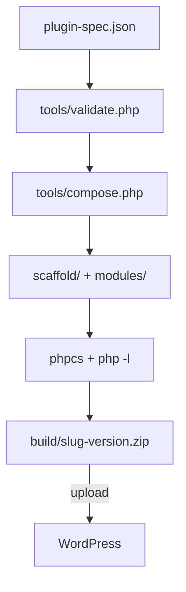

<div align="center">

# AnsariAiWP — WordPress Plugin Factory

[](https://github.com/ansariaiadmin/aiwp/actions/workflows/qa.yml)
[](tools/tests)
[](https://www.php.net/)
[](https://wordpress.org/)
[](LICENSE)

**Made by [Mohammad Ansari](https://ansariai.ir)** · Telegram [@ansariaiadmin](https://t.me/ansariaiadmin) · © 2026 AnsariAi — attribution must be preserved

### 🌐 Language / زبان

**🇬🇧 English (primary)** · **[🇮🇷 راهنمای کامل فارسی را اینجا بخوانید →](docs/README-FA.md)**

</div>

---

## TL;DR

Write a ~30-line JSON spec → get a production-grade, installable WordPress plugin. No PHP coding required. The factory enforces security standards (nonces, capability checks, sanitization, prepared statements) and WPCS linting on every generated file.

```bash
git clone https://github.com/ansariaiadmin/aiwp.git
cd aiwp && chmod +x install.sh && ./install.sh
```

Open the URL printed in your terminal — done. Non-technical users: see [INSTALL.md](INSTALL.md).

---

## What you can build (no coding)

| Plugin | Modules used | Difficulty |
|---|---|---|
| Site Health Scanner (score 0–100 + weekly email report) | `health-scan`, `email-notify`, `scheduler` | ⭐ one command |
| Smart Backup Guardian (adaptive schedule + integrity check) | `backup-alert`, `scheduler` | ⭐ one command |
| Contact form / newsletter / login lock / DB cleaner | `settings-page`, `db-table`, `rest-api` | ⭐⭐ edit one JSON |
| WooCommerce license & sales dashboard | `license-client`, `csv-export`, `blocks-compat` | ⭐⭐⭐ spec + Pro platform |

Full Persian guide for non-technical users: **[docs/README-FA.md](docs/README-FA.md)**

## Quickstart (tested)

```bash
# 1. Clone & install tooling
git clone https://github.com/ansariaiadmin/aiwp.git
cd aiwp && composer install

# 2. Validate & lint
composer validate --strict && composer lint

# 3. Write a spec from an example
cp spec/examples/store-health.json spec/my-plugin.json   # then edit it

# 4. Build: validate -> compose -> syntax check -> lint -> zip
php tools/build.php spec/my-plugin.json
# -> build/my-plugin-1.0.0.zip ready for wp-admin upload
```

## Architecture



**Spec sample — add modules without touching PHP:**

```json
{
  "slug": "my-crm",
  "version": "1.0.0",
  "modules": ["settings-page", "db-table", "rest-api", "sms-gateway"],
  "settings": { "kavenegar_api_key": {"type": "string", "required": true} },
  "db_tables": { "contacts": {"columns": {"id": "BIGINT AUTO_INCREMENT", "phone": "VARCHAR(20)"}} }
}
```

## Available Modules

| Module | Purpose |
|--------|---------|
| `settings-page` | Settings link + guarded reset |
| `scheduler` | Unified background jobs (Action Scheduler → wp-cron fallback) |
| `db-table` | dbDelta table + typed repository |
| `rest-api` | `{slug}/v1` REST with permission_callback + rate limiting |
| `sms-gateway` | Kavenegar + MeliPayamak drivers |
| `email-notify` | Safe wp_mail wrapper |
| `csv-export` | CSV + guarded download |
| `cron-report` | Recurring report + email/CSV |
| `health-scan` | Pro: scoring engine, 30-day trend, auto-fix |
| `backup-alert` | Pro: adaptive schedule, integrity verify, retention |
| `license-client` | Private license server + signed updates |
| `blocks-compat` | WooCommerce Blocks integration |

Each module ships with `module.json` manifest + `src/` + bilingual `README.md`.

## Security & Standards

Every generated plugin enforces: `ABSPATH` guard, nonce + `current_user_can()` on writes, `sanitize_*`/`esc_*`, `$wpdb->prepare()`, WPCS 3.x + PHPCompatibilityWP zero errors, HPOS-safe WooCommerce CRUD, REST rate limiting, uninstall cleanup (`uninstall.php`).

Hardened against known bug-bounty classes: update-channel allowlist + HMAC signature, SSRF guards, secrets masked in API responses, JWT refresh-token rotation with revocation list. See [docs/AUDIT-2026-09-07.md](docs/AUDIT-2026-09-07.md) for the honest audit trail.

## Repository Layout

```
composer.json / phpcs.xml.dist   Tooling
.github/workflows/qa.yml         CI matrix (PHP 8.1/8.2/8.3)
docs/                            ARCHITECTURE.md, MODULE-SPEC.md, README-FA.md, guides/
spec/                            schema + examples
scaffold/                        Boilerplate with {{PLACEHOLDER}} templates
modules/                         Opt-in feature units
tools/                           validate.php, compose.php, build.php, tests/
platform/                        SaaS license server (admin + customer dashboards)
sandbox/                         Disposable WP+MariaDB QA
```

## Documentation Map

| Document | Audience | Language |
|---|---|---|
| [docs/README-FA.md](docs/README-FA.md) | غیرفنی، شروع سریع | فارسی |
| [docs/USER_GUIDE_FA.md](docs/USER_GUIDE_FA.md) | آموزش تصویری گام‌به‌گام | فارسی |
| [docs/USER_GUIDE_EN.md](docs/USER_GUIDE_EN.md) | Step-by-step illustrated guide | English |
| [docs/ARCHITECTURE.md](docs/ARCHITECTURE.md) | Developers / engineers | English |
| [docs/MODULE-SPEC.md](docs/MODULE-SPEC.md) | Module authors | English |
| [ABOUT.md](ABOUT.md) · [DONATE.md](DONATE.md) | Attribution & support | Bilingual |

## Author

**Mohammad Ansari** — [ansariai.ir](https://ansariai.ir) · Telegram [@ansariaiadmin](https://t.me/ansariaiadmin) · GitHub [@ansariaiadmin](https://github.com/ansariaiadmin)

## 💛 Support / حمایت

هر دونیت = شارژ API و ساخت پروژه‌های جدید، رایگان برای همه. Details & wallets: **[DONATE.md](DONATE.md)** ☕

## License

- **AnsariAiWP factory & platform:** MIT © 2026 Mohammad Ansari — see [LICENSE](LICENSE). Attribution preserved in all forks.
- **Plugins generated by the factory:** GPL-2.0-or-later (required for WordPress.org; enforced in every generated file header and in `wp.org` validation mode).
