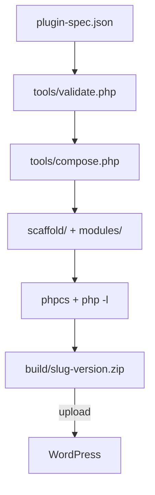

<div align="center">

# AnsariAiWP — WordPress Plugin Factory

[](https://github.com/ansariaiadmin/aiwp/actions/workflows/qa.yml)
[](tools/tests)
[](platform)
[](https://www.php.net/)
[](https://wordpress.org/)
[](https://nextjs.org/)
[](LICENSE)

**Made by [Mohammad Ansari](https://ansariai.ir)** · Telegram [@ansariaiadmin](https://t.me/ansariaiadmin) · © 2026 AnsariAi — attribution must be preserved

### 🌐 Language / زبان

**🇬🇧 English (primary)** · **[🇮🇷 راهنمای کامل فارسی را اینجا بخوانید →](docs/README-FA.md)**

</div>

---

## Contents

- [TL;DR](#tldr) · [What you can build](#what-you-can-build-no-coding) · [Quickstart](#quickstart-tested)
- [Architecture](#architecture) · [Available modules](#available-modules)
- [Security & standards](#security--standards) · [Repository layout](#repository-layout)
- [Documentation map](#documentation-map) · [Author](#author) · [Support](#-support--%D8%AD%DB%8C%D9%85%D8%A7%DB%8C%D8%AA) · [License](#license)

## TL;DR

**AnsariAiWP is a spec-driven WordPress plugin factory + a self-hosted SaaS license platform.** Write a ~30-line JSON spec → get a production-grade, installable WordPress plugin: no PHP coding required. The factory enforces security standards on every generated file — nonces, capability checks, input sanitization, output escaping, prepared SQL statements — and WPCS linting. The bundled Next.js platform sells the plugins you generate: product/plan management, ZarinPal & Stripe checkout, license keys with per-site activations, private update delivery and an AI spec-drafter grounded in the WordPress docs.

```bash
git clone https://github.com/ansariaiadmin/aiwp.git
cd aiwp && chmod +x install.sh && ./install.sh
```

Open the URL printed in your terminal — done. Non-technical users: see [INSTALL.md](INSTALL.md).

---

## What you can build (no coding)

| Plugin | Modules used | Difficulty |
|---|---|---|
| Site Health Scanner (score 0–100 + weekly email report) | `health-scan`, `email-notify`, `scheduler` | ⭐ one command |
| Smart Backup Guardian (adaptive schedule + integrity check) | `backup-alert`, `scheduler` | ⭐ one command |
| Contact form / newsletter / login lock / DB cleaner | `settings-page`, `db-table`, `rest-api` | ⭐⭐ edit one JSON |
| WooCommerce license & sales dashboard | `license-client`, `csv-export`, `blocks-compat` | ⭐⭐⭐ spec + Pro platform |

Full Persian guide for non-technical users: **[docs/README-FA.md](docs/README-FA.md)**

## Quickstart (tested)

```bash
# 1. Clone & install tooling
git clone https://github.com/ansariaiadmin/aiwp.git
cd aiwp && composer install

# 2. Validate & lint
composer validate --strict && composer lint

# 3. Write a spec from an example
cp spec/examples/store-health.json spec/my-plugin.json   # then edit it

# 4. Build: validate -> compose -> syntax check -> lint -> zip
php tools/build.php spec/my-plugin.json
# -> build/my-plugin-1.0.0.zip ready for wp-admin upload
```

## Architecture


```mermaid
flowchart TB
    Spec[plugin-spec.json] --> Validate[tools/validate.php]
    Validate --> Compose[tools/compose.php]
    Compose --> Scaffold[scaffold/ + modules/]
    Scaffold --> Lint[phpcs + php -l]
    Lint --> Zip[build/slug-version.zip]
    Zip -->|upload| WP[WordPress]
```

**Spec sample — add modules without touching PHP** (validates against `spec/plugin-spec.schema.json`):

```json
{
  "slug": "my-crm",
  "name": "My CRM",
  "namespace": "AnsariAi\\MyCrm",
  "prefix": "mycrm",
  "textDomain": "my-crm",
  "version": "1.0.0",
  "modules": ["settings-page", "db-table", "rest-api", "sms-gateway"],
  "options": [
    { "key": "sms_api_key", "type": "password", "label": "Kavenegar API key" },
    { "key": "report_email", "type": "email", "label": "Report email", "default": "" }
  ],
  "features": [
    "Store contacts in the plugin's own table",
    "Send an SMS confirmation when a contact is added"
  ]
}
```

The full reference is [spec/plugin-spec.schema.json](spec/plugin-spec.schema.json); ready-to-build examples live in [spec/examples/](spec/examples/).

## Available Modules

| Module | Purpose |
|--------|---------|
| `settings-page` | Settings link + guarded reset |
| `scheduler` | Unified background jobs (Action Scheduler → wp-cron fallback) |
| `db-table` | dbDelta table + typed repository |
| `rest-api` | `{slug}/v1` REST with permission_callback + rate limiting |
| `sms-gateway` | Kavenegar + MeliPayamak drivers |
| `email-notify` | Safe wp_mail wrapper |
| `csv-export` | CSV + guarded download |
| `cron-report` | Recurring report + email/CSV |
| `health-scan` | Pro: scoring engine, 30-day trend, auto-fix |
| `backup-alert` | Pro: adaptive schedule, integrity verify, retention |
| `license-client` | Private license server + signed updates |
| `blocks-compat` | WooCommerce Blocks integration |

Each module ships with `module.json` manifest + `src/` + bilingual `README.md`.

## Security & Standards

**Generated plugins** — every file the factory emits enforces: `ABSPATH` guard, nonce + `current_user_can()` on every write (via `Guard::verify_write()`), `sanitize_*` on input / `esc_*` on output, `$wpdb->prepare()` for all SQL, WPCS 3.x + PHPCompatibilityWP with zero errors, CSV formula-injection defence, HPOS-declared WooCommerce compatibility, and opt-in data removal in `uninstall.php`.

**Platform (SaaS license server)** — Argon2id password hashing (OWASP parameters), RFC 6238 TOTP with constant-time compare, server-side revocable sessions (JWT + session row), account lockout + per-IP rate limiting, same-origin CSRF verification on every mutating cookie-authenticated route, AES-256-GCM at-rest encryption for stored provider keys (masked in all API responses), append-only audit log, and a server-to-server payment verification flow that provisions a license only after the gateway confirms the transaction.

Every claim above is measured, not assumed — see the audit trail: [docs/AUDIT-2026-09-27.md](docs/AUDIT-2026-09-27.md) (latest) and [docs/AUDIT-2026-09-07.md](docs/AUDIT-2026-09-07.md).

## Repository Layout

```
composer.json / phpcs.xml.dist   Tooling
.github/workflows/qa.yml         CI: PHP 8.4 native + 8.2 docker + platform (Node 22)
docs/                            ARCHITECTURE.md, MODULE-SPEC.md, README-FA.md, audits
spec/                            JSON schema + ready-to-build examples
scaffold/                        Boilerplate with {{PLACEHOLDER}} templates
modules/                         Opt-in feature units (11)
tools/                           validate.php, compose.php, build.php, tests/
platform/                        SaaS license server (admin + customer dashboards)
sandbox/                         Disposable WP+MariaDB QA
```

## Documentation Map

| Document | Audience | Language |
|---|---|---|
| [docs/README-FA.md](docs/README-FA.md) | غیرفنی، شروع سریع | فارسی |
| [docs/USER_GUIDE_FA.md](docs/USER_GUIDE_FA.md) | آموزش تصویری گام‌به‌گام | فارسی |
| [docs/USER_GUIDE_EN.md](docs/USER_GUIDE_EN.md) | Step-by-step illustrated guide | English |
| [docs/ARCHITECTURE.md](docs/ARCHITECTURE.md) | Developers / engineers | English |
| [docs/MODULE-SPEC.md](docs/MODULE-SPEC.md) | Module authors | English |
| [docs/DEVELOPMENT.md](docs/DEVELOPMENT.md) | Hackers: local dev, php-wasm runner, tests | English |
| [platform/docs/DEPLOYMENT.md](platform/docs/DEPLOYMENT.md) | Operators: production Docker deploy | English |
| [docs/AUDIT-2026-09-27.md](docs/AUDIT-2026-09-27.md) | Audited security & quality evidence | Bilingual |
| [CONTRIBUTING.md](CONTRIBUTING.md) · [SECURITY.md](SECURITY.md) | Contributors & bug bounty | English |
| [ABOUT.md](ABOUT.md) · [DONATE.md](DONATE.md) | Attribution & support | Bilingual |

## Author

**Mohammad Ansari** — [ansariai.ir](https://ansariai.ir) · Telegram [@ansariaiadmin](https://t.me/ansariaiadmin) · GitHub [@ansariaiadmin](https://github.com/ansariaiadmin)

## 💛 Support / حمایت

هر دونیت = شارژ API و ساخت پروژه‌های جدید، رایگان برای همه. Details & wallets: **[DONATE.md](DONATE.md)** ☕

## License

- **AnsariAiWP factory & platform:** MIT © 2026 Mohammad Ansari — see [LICENSE](LICENSE). Attribution preserved in all forks.
- **Plugins generated by the factory:** GPL-2.0-or-later (required for WordPress.org; enforced in every generated file header and in `wp.org` validation mode).
